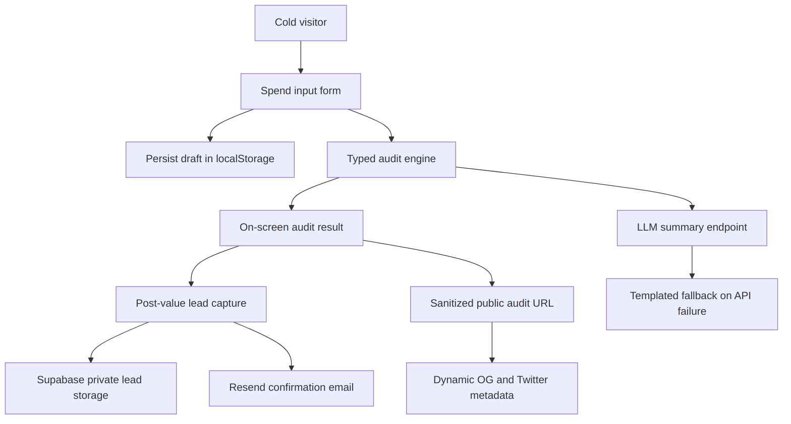

# Architecture

## Data Flow

A user enters team size, use case, tool, plan, monthly spend, and seats. The form persists locally so a refresh does not lose work. The audit engine compares submitted spend against official pricing constants, small-team fit rules, alternative-tool rules, and a conservative discounted-credit estimate for high API-style spend. Results are shown before email capture.

When lead capture is wired, the private email/company fields will be stored separately from the public audit payload. Public audit pages will include tools, plans, savings, and recommendation text, but no email or company name.

## Stack Choice

Next.js React with TypeScript is the app layer. It keeps the product in React while supporting API routes, server-rendered public pages, and dynamic metadata for share previews. Tailwind is used for fast custom UI without an admin template.

Supabase is the planned backend, Resend is the email provider, Anthropic is the preferred LLM provider, and Vercel is the deployment target.

## 10k Audits Per Day

At 10k audits/day, I would move rate limiting to an edge-friendly store, add idempotency keys for audit creation, store normalized pricing snapshots, queue email delivery, and add analytics events for audit completion, report capture, share clicks, and consultation clicks.
