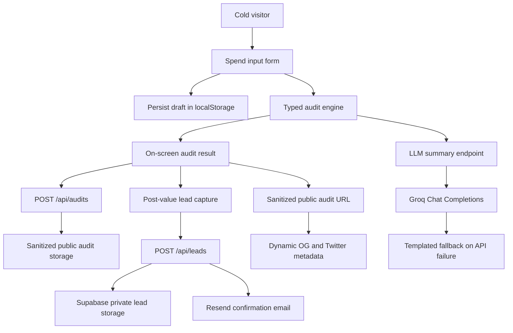

# Architecture

## Data Flow

A user enters team size, use case, tool, plan, monthly spend, and seats. The form persists locally so a refresh does not lose work. The audit engine compares submitted spend against official pricing constants, small-team fit rules, alternative-tool rules, and a conservative discounted-credit estimate for high API-style spend. Results are shown before email capture.

Public audit creation validates the form payload, runs the deterministic audit engine, stores only the sanitized audit request/result, and returns a unique `/audits/[slug]` URL. Lead capture is separate: email, company name, role, and team size are stored in the private `leads` table and never returned from the public audit endpoint.

## Stack Choice

Next.js React with TypeScript is the app layer. It keeps the product in React while supporting API routes, server-rendered public pages, and dynamic metadata for share previews. Tailwind is used for fast custom UI without an admin template.

Supabase is the production backend, Resend is the email provider, Groq is the LLM provider, and Vercel is the deployment target. Local development currently falls back to in-memory storage when Supabase env vars are absent; this keeps demos working, but it is not production storage.

Lead capture stores the lead first, then attempts the Resend confirmation email. Email failure does not roll back the saved lead; the API returns a warning so the UI can be honest without losing the conversion.

Audit creation runs the deterministic audit engine first, then asks Groq to rewrite the result into a short personalized summary. If Groq is unavailable, rate-limited, or returns an empty response, the API stores the deterministic template summary and marks `summarySource: "template"`.

## Abuse Protection

Day 2 uses a honeypot field plus simple IP-based server-side rate limiting on lead capture. This is lightweight enough for an MVP and catches low-effort spam without blocking legitimate founders behind hCaptcha friction. If abuse appears after launch, the next step is Cloudflare Turnstile or hCaptcha.

## 10k Audits Per Day

At 10k audits/day, I would move rate limiting to an edge-friendly store, add idempotency keys for audit creation, store normalized pricing snapshots, queue email delivery, and add analytics events for audit completion, report capture, share clicks, and consultation clicks.
